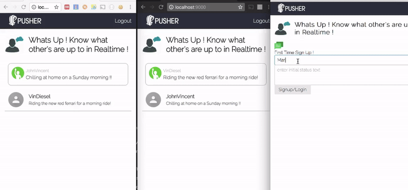
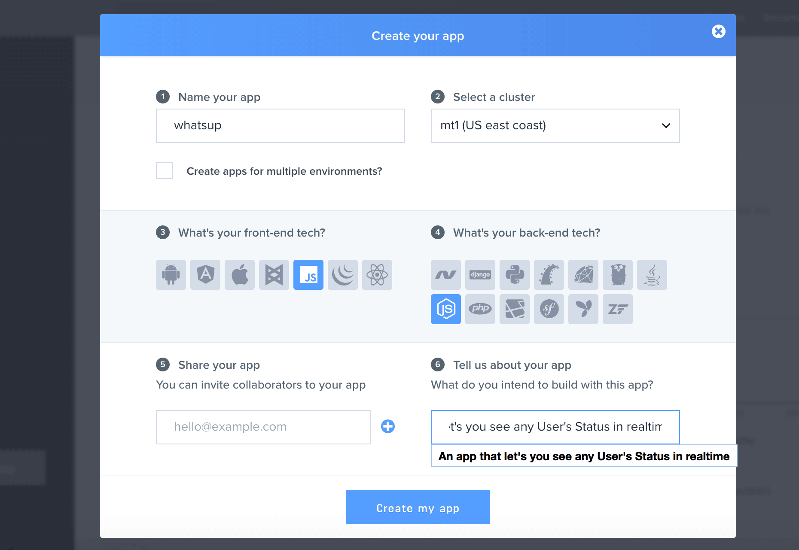
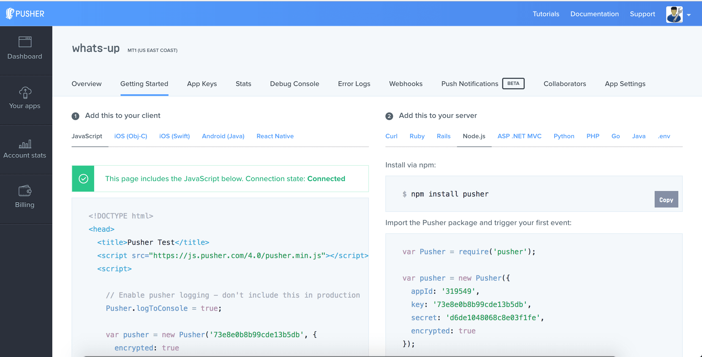
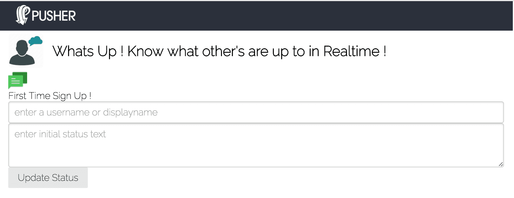

Trong bài đăng trên blog này, chúng tôi sẽ xây dựng một mạng xã hội đơn giản với các tính năng thời gian thực và danh sách tất cả các thành viên đang trực tuyến.

Chúng tôi sẽ sử dụng Node.js làm máy chủ ứng dụng, Vanilla JavaScript ở phía giao diện người dùng và Pusher để giao tiếp thời gian thực giữa máy chủ và phía giao diện người dùng.

Chúng tôi sẽ xây dựng một ứng dụng giống như danh sách bạn bè của bạn hoặc phòng trò chuyện chung, nơi bạn có thể xem ai đang trực tuyến và cập nhật trạng thái mới nhất của họ theo thời gian thực. Trong bài đăng trên blog, chúng ta sẽ tìm hiểu về kênh hiện diện của Pusher và cách biết về các thành viên trực tuyến của kênh này.



Chúng tôi sẽ xây dựng các thành phần sau trong bài đăng trên blog này:

* Máy chủ Node.js sử dụng framework ExpressJS:
  * /registerAPI - Để đăng ký/đăng nhập người dùng mới vào kênh và máy chủ của chúng tôi bằng cách tạo phiên của họ và lưu thông tin của họ
  * /isLoggedInAPI - Để kiểm tra xem người dùng đã đăng nhập hay chưa trong trường hợp làm mới trình duyệt
  * /usersystem/authAPI - Xác thực xác thực được thực hiện bởi Pusher sau khi đăng ký với ứng dụng của chúng tôi và khi đăng ký kênh hiện diện hoặc riêng tư
  * /logoutAPI - Để đăng xuất người dùng và xóa phiên
* Ứng dụng frontend sử dụng Vanilla JavaScript:
  * Biểu mẫu Đăng ký/Đăng nhập - Để đăng ký/đăng nhập người dùng mới bằng cách điền tên người dùng và trạng thái ban đầu của họ
  * Danh sách thành viên - Để xem tất cả những người đang trực tuyến và trạng thái cập nhật của họ
  * Cập nhật trạng thái - Để nhấp vào trạng thái hiện tại và cập nhật nó trên phần mờ của điều khiển chỉnh sửa văn bản trạng thái


Có một số phương thức bạn có thể sử dụng để gửi HTTP request và mỗi phương thức phục vụ một mục đích khác nhau, như được hiển thị bên dưới:

## Đăng ký với Pusher

Bạn có thể tạo một tài khoản miễn phí trong Pusher [Tại đây](https://pusher.com/signup/) . Sau khi bạn đăng ký và đăng nhập lần đầu tiên, bạn sẽ được yêu cầu tạo một ứng dụng mới như trong hình bên dưới. Bạn sẽ phải điền một số thông tin về dự án của mình và cả thư viện front-end hoặc ngôn ngữ back-end mà bạn sẽ sử dụng để xây dựng ứng dụng.



Đối với bài đăng blog cụ thể này, chúng tôi sẽ chọn Vanilla JavaScript cho frontend và Node.js cho backend như trong hình trên. Điều này sẽ chỉ hiển thị cho bạn một bộ mã mẫu khởi đầu cho các lựa chọn này, nhưng bạn có thể sử dụng bất kỳ bộ tích hợp nào sau này với ứng dụng này.



## Máy chủ Node.js

Node.js phải được cài đặt trong hệ thống như một điều kiện tiên quyết cho việc này. Bây giờ chúng ta hãy bắt đầu xây dựng máy chủ Node.js và tất cả các API cần thiết bằng Express. Khởi tạo một dự án nút mới bằng lệnh sau

```cmd
npm init
```
### Cài đặt các phụ thuộc

Chúng tôi sẽ cài đặt các phụ thuộc cần thiết như Express, express-session, Pusher, body-parser, cookie-parser bằng lệnh sau:
```cmd 
npm install express express-session body-parser cookie
```
### Máy chủ nền tảng

các phiên trong đó bằng cách sử dụng mô-đun express-session.
```javascript 
var express = require('express');
var path = require('path');
var bodyParser = require('body-parser');
var expressSession = require('express-session');
var cookieParser = require('cookie-parser');

var app = express();

// must use cookieParser before expressSession
app.use(cookieParser());

app.use(expressSession({
  secret:'<some-secret-token-here>',
  resave: true, 
  saveUninitialized: true
}));

app.use(bodyParser.json());
app.use(bodyParser.urlencoded({ extended: false }));
app.use(express.static(path.join(__dirname, 'public')));

// Error Handler for 404 Pages
app.use(function(req, res, next) {
    var error404 = new Error('Route Not Found');
    error404.status = 404;
    next(error404);
});

module.exports = app;

app.listen(9000, function(){
  console.log('Example app listening on port 9000!')
});
```
Trong đoạn mã trên, chúng tôi đã tạo một máy chủ Express cơ bản và sử dụng phương pháp này, `.use` chúng tôi đã kích hoạt cookie-parser, body-parser và một tệp tĩnh phục vụ từ `public` thư mục. Chúng tôi cũng đã kích hoạt các phiên bằng `express-session` mô-đun. Điều này sẽ cho phép chúng tôi lưu thông tin người dùng trong phiên yêu cầu phù hợp cho người dùng.

### Thêm Pusher

Pusher có một mô-đun NPM nguồn mở cho tích hợp Node.js mà chúng ta sẽ sử dụng. Nó cung cấp một tập hợp các phương pháp tiện ích để tích hợp với API Pusher bằng cách sử dụng một appId, khóa và bí mật duy nhất. Đầu tiên, chúng ta sẽ cài đặt `npm` mô-đun Pusher bằng lệnh sau:
```cmd
npm install pusher --save
```
Bây giờ, chúng ta có thể sử dụng 'require' để lấy module Pusher và tạo một thể hiện mới bằng cách truyền đối tượng options với các khóa quan trọng để khởi tạo tích hợp của chúng ta. Đối với bài đăng trên blog này, tôi đã đặt các khóa ngẫu nhiên; bạn sẽ phải lấy nó cho ứng dụng của mình từ bảng điều khiển Pusher.
```javascript
var Pusher = require('pusher');

var pusher = new Pusher({
  appId: '30XXX64',
  key: '82XXXXXXXXXXXXXXXXXb5',
  secret: '7bXXXXXXXXXXXXXXXX9e',
  encrypted: true
});

var app = express();
...
```
Bạn sẽ phải thay thế `appId`, `key` và a `secret` bằng các giá trị cụ thể cho ứng dụng của riêng bạn. Sau đó, chúng ta sẽ viết mã cho một API mới sẽ được sử dụng để tạo một bình luận mới.

### Đăng ký/Đăng nhập API

Bây giờ, chúng ta sẽ phát triển tuyến API đầu tiên của ứng dụng, qua đó người dùng mới có thể tự đăng ký/đăng nhập và sử dụng trên ứng dụng của chúng ta.
```javascript
app.post('/register', function(req, res){
  console.log(req.body);
  if(req.body.username && req.body.status){
    var newMember = {
      username: req.body.username,
      status: req.body.status
    }
    req.session.user = newMember;
    res.json({  
      success: true,
      error: false
    });
  }else{
    res.json({  
      success: false,
      error: true,
      message: 'Incomplete information: username and status are required'
    });
  }
});
```
Trong đoạn mã trên, chúng tôi đã đưa ra lệnh gọi API POST trên tuyến đường `/register` mong đợi các tham số tên người dùng và trạng thái được truyền vào phần thân yêu cầu. Chúng tôi sẽ lưu thông tin người dùng này trong phiên yêu cầu.

### API xác thực hệ thống người dùng

Để cho phép bất kỳ máy khách nào đăng ký kênh Pusher Private và Presence, chúng ta cần triển khai API xác thực sẽ xác thực yêu cầu của người dùng bằng cách gọi phương thức `Pusher.authenticate` ở phía máy chủ. Thêm mã sau vào máy chủ để đáp ứng điều kiện này:
```javascript
app.post('/usersystem/auth', function(req, res) {
  var socketId = req.body.socket_id;
  var channel = req.body.channel_name;
  var currentMember = req.session.user;
  var presenceData = {
    user_id: currentMember.username,
    user_info: {
      status: currentMember.status,
    }
  };
  var auth = pusher.authenticate(socketId, channel, presenceData);
  res.send(auth);
});
```
Chúng ta cần cung cấp tuyến đường cụ thể trong quá trình khởi tạo thư viện phía máy khách Pusher mà chúng ta sẽ thấy sau trong bài đăng trên blog này. Thư viện máy khách Pusher sẽ tự động gọi tuyến đường này và truyền vào các thuộc tính channel_name và socket_id. Chúng ta sẽ đồng thời lấy thông tin người dùng từ đối tượng phiên người dùng và truyền nó dưới dạng presenceData cho lệnh gọi phương thức Pusher.authenticate.

### API IsLoggedIn và Logout

Nếu người dùng làm mới trình duyệt, ứng dụng phía máy khách sẽ phát hiện xem người dùng đã đăng ký hay chưa. Chúng tôi sẽ triển khai tuyến API **isLoggedIn** cho việc này. Ngoài ra, chúng tôi cần tuyến **đăng xuất** để cho phép bất kỳ người dùng nào đăng xuất khỏi ứng dụng.
```javascript
app.get('/isLoggedIn', function(req,res){
  if(req.session.user){
    res.send({ 
      authenticated: true 
    });
  }else{
    res.send({ authenticated: false });
  }
});

app.get('/logout', function(req,res){
  if(req.session.user){
    req.session.user = null;
  }
  res.redirect('/');
});
```
## Ứng dụng frontend sử dụng Vanilla JavaScript

Chúng tôi sẽ phát triển ứng dụng front-end ngay bây giờ để đăng ký người dùng mới với trạng thái ban đầu, xem các thành viên đang trực tuyến và trạng thái của họ. Chúng tôi cũng sẽ xây dựng tính năng cho người dùng đã đăng nhập để cập nhật người dùng của họ và tất cả người dùng khác sẽ thấy trạng thái được cập nhật theo thời gian thực.

### Bước 1: Tạo một thư mục có tên là public và tạo một index.html

Chúng tôi đã viết mã `server.js` để phục vụ nội dung tĩnh từ `public` thư mục, vì vậy chúng tôi sẽ viết toàn bộ mã giao diện người dùng vào thư mục này.

Vui lòng tạo một thư mục mới `public` và cũng tạo một thư mục trống `index.html` ngay bây giờ.

### Bước 2: Thêm mã mẫu vào index.html của chúng tôi

Chúng tôi sẽ thêm một số mã mẫu cơ bản để thiết lập cấu trúc cơ sở cho ứng dụng web của chúng tôi như Tiêu đề, Mục nơi có thể đặt biểu mẫu đăng ký và danh sách thành viên.
```html
<!DOCTYPE>
<html>
    <head>
        <title>Whats Up ! Know what other's are up to in Realtime !</title>
        <link rel="stylesheet" href="https://unpkg.com/purecss@0.6.2/build/pure-min.css" integrity="sha384-UQiGfs9ICog+LwheBSRCt1o5cbyKIHbwjWscjemyBMT9YCUMZffs6UqUTd0hObXD" crossorigin="anonymous">
        <link rel="stylesheet" href="https://fonts.googleapis.com/css?family=Raleway:200">
        <link rel="stylesheet" href="./style.css">
        <meta name="viewport" content="width=device-width, initial-scale=1.0">
    </head>
    <body>
        <header>
            <div class="logo">
                
            </div>
            <div id="logout" class="logout">
               <a href="/logout">Logout</a>
            </div>
        </header>
        <section class="subheader">
            
            <h2>Whats Up ! Know what other's are up to in Realtime !</h2>
        </section>
        <section>
           <div id="loader" class="loader">
           </div>
           <script id="member-template" type="text/x-template">
            </script>
           <div id="me" class="me">
           </div>
           <div id="membersList" class="members-list">
           </div>
           <div id="signup-form" class="tab-content">
                <div class="header">
                    <div></div>
                    <div class="text">First Time Sign Up !</div>
                </div>
                <form class="pure-form" id="user-form">
                    <div class="signup-form">
                        <div class="left-side">
                            <div class="row">
                                <input type="text" required placeholder="enter a username or displayname" id="display_name">
                            </div>
                            <div class="row">
                                <textarea placeholder="enter initial status text" required id="initial_status" rows="3"></textarea>
                            </div>
                        </div>
                        <div class="right-side">
                            <button 
                                type="submit" 
                                class="button-secondary pure-button">Signup/Login</button>
                        </div>
                    </div>
                </form>
            </div>
        </section>
        <script src="https://js.pusher.com/4.0/pusher.min.js"></script>
        <script type="text/javascript" src="./app.js"></script>
    </body>
</html>
```
Trong đoạn mã boilerplate ở trên, chúng tôi đã tham chiếu đến tệp Javascript chính `app.js` và thư viện JS phía máy khách Pusher. Chúng tôi cũng có một thẻ script nơi chúng tôi sẽ đặt mẫu cho một hàng thành viên trong danh sách thành viên. Ngoài ra, chúng tôi có hai thẻ div trống với id là me và membersList để chứa tên và thông tin thành viên đã đăng nhập, cũng như danh sách tất cả các thành viên khác cùng với trạng thái của họ.

### Bước 3: Style.css

Điều quan trọng cần lưu ý là chúng tôi sẽ hiển thị biểu mẫu đăng ký lần đầu tiên và nút MembersList và Logout sẽ bị ẩn theo mặc định ban đầu. Vui lòng tạo một tệp mới có tên `style.css` và thêm css sau vào đó:

```css
body{
    margin:0;
    padding:0;
    overflow: hidden;
    font-family: Raleway;
}

header{
    background: #2b303b;
    height: 50px;
    width:100%;
    display: flex;
    color:#fff;
}


.loader,
.loader:after {
  border-radius: 50%;
  width: 10em;
  height: 10em;
}
.loader {
  margin: 60px auto;
  font-size: 10px;
  position: relative;
  text-indent: -9999em;
  border-top: 1.1em solid rgba(82,0,115, 0.2);
  border-right: 1.1em solid rgba(82,0,115, 0.2);
  border-bottom: 1.1em solid rgba(82,0,115, 0.2);
  border-left: 1.1em solid #520073;
  -webkit-transform: translateZ(0);
  -ms-transform: translateZ(0);
  transform: translateZ(0);
  -webkit-animation: load8 1.1s infinite linear;
  animation: load8 1.1s infinite linear;
}
@-webkit-keyframes load8 {
  0% {
    -webkit-transform: rotate(0deg);
    transform: rotate(0deg);
  }
  100% {
    -webkit-transform: rotate(360deg);
    transform: rotate(360deg);
  }
}
@keyframes load8 {
  0% {
    -webkit-transform: rotate(0deg);
    transform: rotate(0deg);
  }
  100% {
    -webkit-transform: rotate(360deg);
    transform: rotate(360deg);
  }
}


.subheader{
    display: flex;
    align-items: center;
    margin: 0px;
}

.whatsup-logo{
    height:60px;
    border-radius: 8px;
    flex:0 60px;
    margin-right: 15px;
}

.logout{
    flex:1;
    justify-content: flex-end;
    padding:15px;
    display: none;
}

.logout a{
    color:#fff;
    text-decoration: none;
}

#signup-form{
    display: none;
}

input, textarea{
  width:100%;
}


section{
    padding: 0px 15px;
}

.logo img{
    height: 35px;
    padding: 6px;
    margin-left: 20px;
}

#updateStatus{
    display: none;
}

.members-list{
    display: none;
    flex-direction: column;
}

.me {
  display: none;
}
```
Vui lòng thử mở URL http://localhost:9000 trong trình duyệt của bạn và ứng dụng sẽ tải với biểu mẫu đăng ký hoặc đăng nhập cơ bản với tên người dùng và trạng thái. Đầu ra sẽ trông giống như ảnh chụp màn hình bên dưới:

### Bước 4: Thêm mã cơ bản app.js

Bây giờ chúng ta sẽ thêm mã Javascript để có các thành phần tiện ích cơ bản bên trong một hàm tự gọi để tạo phạm vi riêng cho các biến ứng dụng của chúng ta. Chúng ta không muốn làm ô nhiễm phạm vi toàn cục của JS.
```javascript
// Using IIFE for Implementing Module Pattern to keep the Local Space for the JS Variables
(function() {
    // Enable pusher logging - don't include this in production
    Pusher.logToConsole = true;

    var serverUrl = "/",
        members = [],
        pusher = new Pusher('73xxxxxxxxxxxxxxxdb', {
          authEndpoint: '/usersystem/auth',
          encrypted: true
        }),
        channel,
        userForm = document.getElementById("user-form"),
        memberTemplateStr = document.getElementById('member-template').innerHTML;

    function showEle(elementId){
      document.getElementById(elementId).style.display = 'flex';
    }

    function hideEle(elementId){
      document.getElementById(elementId).style.display = 'none';
    }

    function ajax(url, method, payload, successCallback){
      var xhr = new XMLHttpRequest();
      xhr.open(method, url, true);
      xhr.setRequestHeader("Content-Type", "application/json;charset=UTF-8");
      xhr.onreadystatechange = function () {
        if (xhr.readyState != 4 || xhr.status != 200) return;
        successCallback(xhr.responseText);
      };
      xhr.send(JSON.stringify(payload));
    }

    ajax(serverUrl+"isLoggedIn","GET",{},isLoginChecked);

    function isLoginChecked(response){
      var responseObj = JSON.parse(response);
      if(responseObj.authenticated){
        channel = pusher.subscribe('presence-whatsup-members');
        bindChannelEvents(channel);
      }
      updateUserViewState(responseObj.authenticated);
    }

    function updateUserViewState(isLoggedIn){
      document.getElementById("loader").style.display = "none";
      if(isLoggedIn){
        document.getElementById("logout").style.display = "flex";
        document.getElementById("signup-form").style.display = "none";
      }else{
        document.getElementById("logout").style.display = "none";
        document.getElementById("signup-form").style.display = "block";
      }
    }

    function showLoader(){
        document.getElementById("loader").style.display = "block";
        document.getElementById("logout").style.display = "none";
        document.getElementById("signup-form").style.display = "none";
    }

    // Adding a new Member Form Submit Event
    userForm.addEventListener("submit", addNewMember);


    function addNewMember(event){
      event.preventDefault();
      var newMember = {
        "username": document.getElementById('display_name').value,
        "status": document.getElementById('initial_status').value
      }
      showLoader();
      ajax(serverUrl+"register","POST",newMember, onMemberAddSuccess);
    }

    function onMemberAddSuccess(response){
        // On Success of registering a new member
        console.log("Success: " + response);
        userForm.reset();
        updateUserViewState(true);
        // Subscribing to the 'presence-members' Channel
        channel = pusher.subscribe('presence-whatsup-members');
        bindChannelEvents(channel);
    }
})();
```
Trong đoạn mã trên, chúng ta đã tham chiếu đến tất cả các biến quan trọng mà chúng ta sẽ yêu cầu. Chúng ta cũng sẽ khởi tạo thư viện Pusher bằng cách sử dụng Pusher mới và truyền khóa api làm đối số đầu tiên. Đối số thứ hai chứa một đối tượng cấu hình tùy chọn trong đó chúng ta sẽ thêm khóa `authEndpoint` với tuyến api nút tùy chỉnh `/usersystem/auth` và cũng thêm khóa `encrypted` thiết lập giá trị true.

Chúng tôi sẽ tạo một vài hàm chung để hiển thị hoặc ẩn một phần tử bằng cách truyền id duy nhất của nó. Chúng tôi cũng đã thêm một phương thức chung có tên là ajax để thực hiện các yêu cầu ajax bằng đối tượng XMLHttp trong Vanilla JavaScript.

Khi tải trang, chúng tôi thực hiện yêu cầu ajax để kiểm tra xem người dùng đã đăng nhập hay chưa. Nếu người dùng đã đăng nhập, chúng tôi sẽ trực tiếp sử dụng phiên bản Pusher để đăng ký người dùng vào kênh hiện diện có tên là `presence-whatsup-members`, bạn có thể có kênh này làm phòng trò chuyện hoặc vị trí ứng dụng duy nhất mà bạn muốn báo cáo/theo dõi các thành viên trực tuyến.

Chúng tôi cũng đã viết một phương pháp ở trên để `addNewMember` sử dụng yêu cầu ajax đến `register` tuyến api mà chúng tôi đã xây dựng trong Node.js. Chúng tôi sẽ truyền tên và trạng thái ban đầu được nhập vào biểu mẫu.

Chúng tôi cũng có một phương pháp để cập nhật trạng thái xem của người dùng dựa trên trạng thái đã đăng nhập. Phương pháp này không làm gì ngoài việc cập nhật khả năng hiển thị của danh sách thành viên, nút đăng xuất và biểu mẫu đăng ký. Chúng tôi đã sử dụng một `bindChannelEvents` phương pháp khi người dùng đã đăng nhập mà chúng tôi sẽ triển khai sau trong bài đăng trên blog.

Vui lòng thêm đoạn css sau vào `style.css` tệp để hiển thị `me` phần tử phù hợp với tên người dùng và trạng thái của người dùng đã đăng nhập.
```css

.me {
    border:1px solid #aeaeae;
    padding:10px;
    margin:10px;
    border-radius: 10px;
}

.me img{
    height: 40px;
    width: 40px;
}

.me .status{
    padding:5px;
    flex:1;
}

.me .status .username{
    font-size:13px;
    color: #aeaeae;
    margin-bottom:5px;
}

.me .status .text{
    font-size: 15px;
    width:100%;
    -webkit-transition: all 1s ease-in 5ms;
    -moz-transition: all 1s ease-in 5ms;
    transition: all 1s ease-in 5ms;
}
```
### Bước 5: Thêm mã để hiển thị danh sách thành viên và bindChannelEvents

Bây giờ, sau khi đăng ký kênh, chúng ta cần liên kết một số sự kiện nhất định để có thể biết khi nào có thành viên mới được thêm vào kênh hoặc xóa khỏi kênh. Chúng ta cũng sẽ liên kết với một sự kiện tùy chỉnh để biết khi nào có người cập nhật trạng thái của họ.

Thêm đoạn mã sau vào `app.js` tệp:
```javascript
// Binding to Pusher Events on our 'presence-whatsup-members' Channel

  function bindChannelEvents(channel){
      channel.bind('client-status-update',statusUpdated);
      var reRenderMembers = function(member){
        renderMembers(channel.members);
      }
      channel.bind('pusher:subscription_succeeded', reRenderMembers);
      channel.bind('pusher:member_added', reRenderMembers);
      channel.bind('pusher:member_removed', reRenderMembers);
    }
```
Trong phương pháp trên `bindChannelEvents`, chúng ta sử dụng `channel.bind` phương pháp này để liên kết trình xử lý sự kiện cho 3 sự kiện nội bộ - `pusher:subscription_succeeded`, `pusher:member_added`, `pusher:member_removed` và 1 sự kiện tùy chỉnh - `client-status-update.`

Bây giờ chúng ta sẽ thêm mã JavaScript để hiển thị danh sách thành viên. Điều quan trọng là phải biết rằng đối tượng mà tôi trả về từ `.subscribe` phương thức có một thuộc tính được gọi `members` là có thể được sử dụng để biết thông tin về người dùng đã đăng nhập được tham chiếu bởi khóa `me` và các thành viên khác theo khóa `members`. Thêm mã sau vào `app.js` tệp

```javascript

// Render the list of members with updated data and also render the logged in user component

    function renderMembers(channelMembers){
      var members = channelMembers.members;
      var membersListNode = document.createElement('div');
      showEle('membersList');

      Object.keys(members).map(function(currentMember){
        if(currentMember !== channelMembers.me.id){
          var currentMemberHtml = memberTemplateStr;
          currentMemberHtml = currentMemberHtml.replace('{{username}}',currentMember);
          currentMemberHtml = currentMemberHtml.replace('{{status}}',members[currentMember].status);
          currentMemberHtml = currentMemberHtml.replace('{{time}}','');
          var newMemberNode = document.createElement('div');
          newMemberNode.classList.add('member');
          newMemberNode.setAttribute("id","user-"+currentMember);
          newMemberNode.innerHTML = currentMemberHtml;
          membersListNode.appendChild(newMemberNode);
        }
      });
      renderMe(channelMembers.me);
      document.getElementById("membersList").innerHTML = membersListNode.innerHTML;
    }


    function renderMe(myObj){
      document.getElementById('myusername').innerHTML = myObj.id;
      document.getElementById('mystatus').innerHTML = myObj.info.status;
    }
```
Chúng tôi đã thêm trình xử lý sự kiện cho sự kiện thêm/xóa thành viên mới để hiển thị lại danh sách thành viên để danh sách này chỉ được cập nhật với các thành viên trực tuyến. Để hiển thị danh sách thành viên, chúng tôi cần thêm kiểu sau vào tệp của mình `style.css`.
```css

.member{
    display: flex;
    border-bottom: 1px solid #aeaeae;
    margin-bottom: 10px;
    padding: 10px;
}

.member .user-icon{
    flex:0 40px;
    display: flex;
    align-items: center;
    justify-content: center;
}

.member .user-icon img{
    width:50px;
    height:50px;
}

.member .user-info{
    padding:5px;
    margin-left:10px;
}

.member .user-info .name{
    font-weight: bold;
    font-size: 16px;
    padding-bottom:5px;
}

.member .user-info .status{
    font-weight: normal;
    font-size:13px;
}

.member .user-info .time{
    font-weight: normal;
    font-size:10px;
    color:#aeaeae;
}
```
Bây giờ chúng ta sẽ viết mã để kích hoạt sự kiện máy khách trên kênh của chúng ta để thông báo cho tất cả người dùng về sự thay đổi trạng thái của người dùng đã đăng nhập. Thêm mã sau vào `app.js` tệp của bạn.
```javascript
 // On Blur of editting my status update the status by sending Pusher event
    document.getElementById('mystatus').addEventListener('blur',sendStatusUpdateReq);

    function sendStatusUpdateReq(event){
      var newStatus = document.getElementById('mystatus').innerHTML;
      var username = document.getElementById('myusername').innerText;
      channel.trigger("client-status-update", {
        username: username,
        status: newStatus
      });
    }

    // New Update Event Handler
    // We will take the Comment Template, replace placeholders and append to commentsList
    function statusUpdated(data){
      var updatedMemberHtml = memberTemplateStr;
          updatedMemberHtml = updatedMemberHtml.replace('{{username}}',data.username);
          updatedMemberHtml = updatedMemberHtml.replace('{{status}}',data.status);
          updatedMemberHtml = updatedMemberHtml.replace('{{time}}','just now');
      document.getElementById("user-"+data.username).style.color = '#1B8D98';    
      document.getElementById("user-"+data.username).innerHTML=updatedMemberHtml;
      setTimeout(function(){
        document.getElementById("user-"+data.username).style.color = '#000';
      },500);
    }
```
***QUAN TRỌNG*** : Khi chúng ta chạy mã này trong trình duyệt của mình, cập nhật trạng thái và làm mờ điều khiển trạng thái, chúng ta sẽ gặp lỗi trong bảng điều khiển JavaScript cho thư viện Pusher. Để khắc phục lỗi này, hãy vào bảng điều khiển tại trang web Pusher.com, vào cài đặt và bật gửi sự kiện trực tiếp từ máy khách.
```JSON
Pusher : Error : {
  "type":"WebSocketError",
  "error":{
    "type":"PusherError",
    "data":
      {
        "code":null,
        "message":"To send client events, you must enable this feature in the Settings page of your dashboard."
      }
   }
}
```
## Phần kết luận

Chúng tôi đã xây dựng một ứng dụng sẽ hiển thị tất cả các thành viên trực tuyến cho một kênh hiện diện cụ thể và các cập nhật của họ. Nếu bất kỳ người dùng trực tuyến nào cập nhật trạng thái của họ, mọi người dùng sẽ được thông báo về trạng thái đã cập nhật.

Thành phần hoặc mã này có thể được sử dụng để phát triển phần mạng xã hội trong hầu hết các ứng dụng web hiện nay. Đây là trường hợp sử dụng quan trọng khi người dùng cần biết về những người tham gia khác có sẵn. Ví dụ: ứng dụng lớp học trực tuyến có thể thấy những người tham gia khác và trạng thái có thể tương ứng với bất kỳ câu hỏi nào mà bất kỳ người tham gia nào muốn hỏi người thuyết trình.


<style>
    .max-w-prose {
        max-width: 825px;
        justify-content: center;
        margin-left: auto;
        margin-right: auto;
    }
</style>